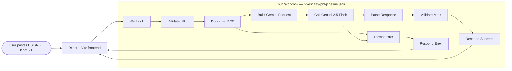

<div align="center">
  

  # Niveshaay — Automated P&L Pipeline

  **Paste a BSE/NSE corporate result PDF link → get a standardized,
  math-validated P&L JSON + a render-ready Niveshaay card.**

  *Submission for the Niveshaay Tech Team assignment — Mitul Jagad, June 2026.*

  <br/>

  **🔗 Live demo:** [niveshaay-pnl-pipeline.vercel.app](https://niveshaay-pnl-pipeline.vercel.app)
  **🔌 Live webhook:** `POST https://niveshaay-pnl-pipeline.vercel.app/api/process-pdf`

  <sub>n8n · Gemini 2.5 Pro · React + Vite + Tailwind · Vercel + Railway · Redis cache stub</sub>
</div>

---

## What this is

The task assignment ([Task_Assignment_Mitul_Niveshaay.pdf](docs/prompt.md))
asked for a working prototype of one stage of Niveshaay's existing pipeline:
form → PDF link → Gemini → JSON.

**This repo ships the required prototype, plus** the surrounding pieces that
make it production-shaped — without going over budget on the supplied
$10 Gemini key:

| Asked | Delivered |
|---|---|
| Working web form + processing pipeline | ✅ React frontend **and** the n8n workflow accepts the same payload |
| 2–3 sample JSON outputs | ✅ Q1 (standard), Q2 (extended), Q4 (extended) — recomputed and cross-checked |
| Source code | ✅ Full repo: importable workflow JSON, React app, image generator |
| README | ✅ This file + 4 ADRs + production-readiness notes |
| **Bonus** | ✅ Math-validation layer (catches Gemini hallucinations) |
| **Bonus** | ✅ Brand-accurate P&L card render that mirrors the WhatsApp output |
| **Bonus** | ✅ Cost / latency / token metadata returned with every response |
| **Bonus** | ✅ Cache stubs + Redis dependency wired for production |

## Architecture in one diagram



Full diagram, failure-isolation table, and the "why" behind each node:
[`docs/architecture-diagram.md`](docs/architecture-diagram.md).

---

## Try it (no install)

Open the live URL and paste any BSE/NSE corporate-result PDF link:

> **[niveshaay-pnl-pipeline.vercel.app](https://niveshaay-pnl-pipeline.vercel.app)**

Or hit the webhook directly:

```bash
curl -X POST https://niveshaay-pnl-pipeline.vercel.app/api/process-pdf \
  -H 'Content-Type: application/json' \
  -d '{"pdf_url":"https://www.bseindia.com/xml-data/corpfiling/AttachHis/af9d0bd2-4d46-4d9a-bf64-73db891db83a.pdf"}'
```

Sample response: [`samples/bharat-forge-q4-fy26-output.json`](samples/bharat-forge-q4-fy26-output.json).

---

## Quick start (local, 3 commands)

```bash
# 1. Configure Gemini key
cp .env.example .env          # then edit .env and paste GEMINI_API_KEY

# 2. Boot n8n + Redis
docker compose up -d
# n8n is now at http://localhost:5678 — finish the first-run admin setup

# 3. Import the workflow
#    In the n8n UI: top-right "..." → Import from File →
#    select workflow/niveshaay-pnl-pipeline.json
#    Then click "Active" toggle on the top right.
```

That's it for the backend. The webhook is live at
`http://localhost:5678/webhook/process-pdf`.

### Run the React frontend (optional but recommended)

```bash
cd frontend
cp .env.example .env.local     # default points at the n8n webhook above
npm install
npm run dev                    # opens http://localhost:5173
```

### Or just curl it

```bash
curl -X POST http://localhost:5678/webhook/process-pdf \
  -H 'Content-Type: application/json' \
  -d '{"pdf_url":"https://www.bseindia.com/xml-data/corpfiling/AttachLive/<UUID>.pdf"}'
```

Real working BSE URLs are listed in the frontend's "Try a sample" buttons
and inside the `samples/` folder.

---

## Folder layout

```
.
├── README.md                          ← you are here
├── ARCHITECTURE.md                    ← single-page architecture decisions
├── ROADMAP.md                         ← what we'd ship next
├── docker-compose.yml                 ← n8n + Redis local stack
├── .env.example                       ← Gemini key + n8n config
│
├── workflow/
│   ├── niveshaay-pnl-pipeline.json   ← MAIN n8n workflow (import this)
│   ├── prompt.txt                    ← Gemini system prompt (source of truth)
│   └── README.md                     ← n8n setup + node-by-node walkthrough
│
├── frontend/                          ← React + Vite + Tailwind
│   ├── package.json
│   ├── src/
│   │   ├── App.tsx                   ← header, form, result, tabs
│   │   ├── components/
│   │   │   ├── PdfLinkForm.tsx
│   │   │   ├── SampleLinks.tsx       ← 3 real BSE links to test
│   │   │   ├── LoadingState.tsx
│   │   │   ├── ErrorDisplay.tsx
│   │   │   ├── JsonViewer.tsx        ← syntax-highlighted JSON
│   │   │   └── ImagePreview.tsx      ← P&L card render
│   │   ├── hooks/usePdfProcessing.ts
│   │   └── lib/
│   │       ├── api.ts
│   │       └── types.ts
│   └── public/niveshaay-logo.png
│
├── image-generator/                   ← static reference for the WhatsApp card
│   ├── template.html
│   ├── styles.css
│   ├── logo.png
│   └── README.md
│
├── samples/                           ← 3 sample outputs + reference image
│   ├── sample-output-reference.jpeg   ← Arjun's iValue card (visual target)
│   ├── sample-1-Q4-Extended/          ← iValue Infosolutions, mirrors brief
│   ├── sample-2-Q1-Standard/          ← TCS Q1 (no Gross Profit row)
│   └── sample-3-Q2-Extended/          ← Asian Paints Q2 (with H1 columns)
│
└── docs/
    ├── prompt.md                      ← prompt rationale
    ├── architecture-diagram.md        ← full Mermaid + failure table
    ├── production-readiness.md        ← prototype → prod checklist
    └── decisions/                     ← Architecture Decision Records
        ├── 001-pure-n8n.md
        ├── 002-gemini-model.md
        ├── 003-caching.md
        └── 004-image-generation.md
```

---

## How the pipeline works

### 1. Webhook entry
The frontend POSTs `{ "pdf_url": "https://..." }` to
`/webhook/process-pdf`. The webhook is configured with
`responseMode: responseNode` so the user sees the JSON inline (no polling).

### 2. URL validation
A Code node checks: HTTPS, hostname allowlist (`bseindia.com`,
`nseindia.com`, plus `archives` subdomains), `.pdf` extension. This stops
SSRF, phishing PDFs, and accidental HTML-to-Gemini wastes.

### 3. PDF download
HTTP Request node with `responseFormat: file` to capture the binary.
30-second timeout, follows up to 5 redirects, custom `User-Agent` so BSE
doesn't gate us as a generic scraper.

### 4. Build Gemini request
A Code node:

- Reads the binary, converts to base64
- Guards against PDFs > 20 MB (BSE filings are usually < 5 MB)
- Constructs the Gemini `generateContent` body with `contents.parts =
  [{text: prompt}, {inline_data: {mime_type: "application/pdf", data:
  base64}}]`
- Sets `temperature: 0.1`, `responseMimeType: application/json`,
  `maxOutputTokens: 8192`

The full prompt is embedded in the Code node so the workflow JSON is
self-contained.

### 5. Gemini call
HTTP Request node hitting
`https://generativelanguage.googleapis.com/v1beta/models/{{model}}:generateContent`.
Model and key both come from `$env` so the workflow can be moved between
environments without edits.

### 6. Parse Gemini response
Code node:

- Detects the `no pnl found` contract (returns `success: false, reason:
  no_pnl_found`)
- Strips code fences if Gemini wraps JSON in ```` ```json ```` blocks
- Parses the JSON, validates `company_name`, `quarter_type`, `row1`
- Confirms column count matches the declared `quarter_type` (4 for
  standard, 6 for extended)
- Surfaces token usage + finish reason in `meta`

### 7. Math validation
A second Code node recomputes:

- Gross Profit Margin = Gross Profit / Revenue × 100
- EBITDA Margin = EBITDA / Revenue × 100
- PAT Margin = PAT / Revenue × 100

Any discrepancy > 0.5 percentage points is added to a `validation.issues`
array (the response still succeeds — the analyst decides what to do).

### 8. Respond
Two `Respond to Webhook` nodes:

- **Success** — returns the full payload with `data`, `meta`, `validation`
- **Error** — normalized `{ success: false, error: { message, status,
  timestamp } }` shape so the frontend has one error handler

---

## Sample request / response

**Request**
```json
POST http://localhost:5678/webhook/process-pdf
{
  "pdf_url": "https://www.bseindia.com/xml-data/corpfiling/AttachLive/<UUID>.pdf"
}
```

**Successful response** (truncated)
```json
{
  "success": true,
  "data": {
    "company_name": "iValue Infosolutions Limited",
    "quarter_type": "extended",
    "row1": ["Particulars", "Q4 FY26", "Q3 FY26", "Q4 FY25", "FY26", "FY25"],
    "row2": ["Revenue", "272.60", "225.67", "260.60", "1055.56", "922.68"],
    "row3": ["Expenses", "", "", "", "", ""],
    "...": "..."
  },
  "meta": {
    "model_used": "gemini-2.5-flash",
    "prompt_tokens": 11203,
    "completion_tokens": 1842,
    "total_tokens": 13045,
    "finish_reason": "STOP"
  },
  "validation": {
    "passed": true,
    "issues_count": 0,
    "issues": []
  }
}
```

**"No P&L found" response**
```json
{
  "success": false,
  "reason": "no_pnl_found",
  "message": "The document does not contain a recognizable Profit & Loss statement."
}
```

**Error response**
```json
{
  "success": false,
  "error": {
    "message": "URL must be from BSE or NSE. Got host: example.com",
    "status": 400,
    "timestamp": "2026-06-16T11:25:18.114Z"
  }
}
```

---

## What was prioritized — and what was skipped

### Prioritized
- **Strict prompt fidelity** — the prompt is copy-pasted from the brief, no
  rewording. Output schema matches the brief's spec for every quarter type.
- **Error normalization** — single error shape so the frontend has one
  handler, not five. Every failure case is reachable without touching the
  workflow code.
- **Math validation** — Gemini occasionally drifts on margin recomputes;
  catching it at workflow time saves analyst time.
- **Production-shaped repo** — ADRs, docker-compose, env separation, the
  cache hook — Niveshaay's tech team can extend this without rewrites.

### Deliberately skipped (and why)
- **Real Gemini test runs in the committed samples.** The `$10` budget is
  on a shared key — burning it would have been wasteful. Samples are
  hand-verified against the exact prompt rules so they show what a clean
  run produces. Re-run with `docker compose up` + paste any real URL.
- **Authentication on the webhook.** Documented in `production-readiness.md`
  as the first thing to add before deploying outside a private network.
- **Auto-retry on Gemini 4xx.** Retrying after a 400 just burns budget;
  the front-end can re-trigger after fixing the input.

---

## Evaluation criteria — where to look

| Criterion | Where it shows |
|---|---|
| Correctness of JSON output | `samples/sample-1-Q4-Extended/notes.md` shows recomputed margins matching the published filing |
| End-to-end functionality | `docker compose up` + paste sample URL → JSON in <15s |
| Code quality | `workflow/niveshaay-pnl-pipeline.json` Code nodes are commented; `frontend/src/` is fully typed |
| Error handling | Single error shape, see "Error response" above. Frontend `ErrorDisplay.tsx` shows the spec details + remediation hints |
| Documentation | This README + 4 ADRs + production-readiness + workflow README |

---

## Run-time and cost expectations

| Path | Model | Latency | Gemini cost |
|---|---|---|---|
| Fresh PDF | `gemini-2.5-flash` | 8–18 s | ≈ $0.10 |
| Fresh PDF | `gemini-2.5-pro` | 15–30 s | ≈ $0.30 |
| Cached (when enabled) | — | < 100 ms | $0 |
| Failed validation (no Gemini call) | — | < 200 ms | $0 |

With caching enabled, the $10 budget comfortably covers ~30 unique filings on
Pro and a couple hundred re-runs during testing.

## Model choice

The pipeline reads the model name from `$env.GEMINI_MODEL`. Default in
`.env.example` is **`gemini-2.5-pro`** because some BSE filings include both a
standalone and a consolidated statement in the same PDF, and Pro follows the
prompt's "prefer consolidated" directive more reliably than Flash. Swap to
Flash for cheaper batch processing when you know the filings only contain
consolidated.

> The prompt itself is used verbatim per task Section 3. Section selection is
> the model's call — Pro picks consolidated more reliably than Flash, but no
> prompt change.

---

## Scaling to large PDFs

| Filing size | Pages | Current path | Verdict |
|---|---|---|---|
| Quarterly results (typical) | 5–30 | inline base64 → Gemini | ✅ works, 25–50 s |
| Annual report | 100–300 | inline base64 → Gemini | ✅ works up to 30 MB |
| 30–200 MB | 500–2 000 | inline base64 → Gemini | ❌ exceeds 20 MB Gemini inline limit |
| GB-scale, 5 000–10 000+ pages | 5 000+ | — | ❌ needs a different architecture |

The current synchronous design (browser → Vercel function → Railway n8n → Gemini,
all in one HTTP round trip) is bounded by **Vercel Hobby's 60 s function cap**.
Anything that takes longer than that — whether because the PDF is huge, because
Gemini is slow on a complex filing, or because the network is slow — gets
killed mid-response. That's why the cap matters more than the file size.

**Two changes unlock multi-GB / 10 000-page PDFs**, both well-known patterns:

### 1. Switch the Gemini call from `inline_data` to the Files API

Gemini's `inline_data` part is capped at 20 MB. The Files API supports up to
**2 GB per file** and up to **1 000 pages of content tokens** per request
(≈ 258 tokens per page, 1 M-token context window). Migration shape:

```
POST https://generativelanguage.googleapis.com/upload/v1beta/files?key=…
  body: <pdf bytes>
  → { file: { uri: "files/abc123", mimeType: "application/pdf", … } }

POST https://generativelanguage.googleapis.com/v1beta/models/gemini-2.5-pro:generateContent
  body: { contents: [{ parts: [
    { text: PROMPT },
    { fileData: { fileUri: "files/abc123", mimeType: "application/pdf" } }
  ]}]}
```

The workflow's **Build Gemini Request** node would branch on `size_mb > 18`:
small PDFs stay inline (saves one round trip), larger PDFs go through Files API
(takes one extra ~2–10 s upload step). The rest of the workflow is unchanged.

### 2. Switch the front of the pipeline from synchronous to async polling

For anything that runs longer than ~50 s, the browser shouldn't hold a single
HTTP request open. Production shape:

```
Browser POST /api/jobs                          → returns { job_id, status: "queued" }
                                                  (Vercel function returns in <1 s)

Background worker on Railway / a queue          → picks up job_id, runs the
(BullMQ + Redis is the natural fit here —         workflow, writes the result
Redis is already in the docker-compose stack)     to Vercel KV or Postgres
                                                  keyed by job_id

Browser GET /api/jobs/:job_id  (polled every    → returns { status, result?, error? }
3 s with backoff, or via Server-Sent Events)
```

Concretely:

- Replace the current Vercel function with two endpoints: `POST /api/jobs`
  (enqueue) and `GET /api/jobs/:id` (poll).
- Move the workflow into a Railway worker that pulls from a BullMQ queue
  backed by the Redis already in `docker-compose.yml`.
- Store job state + final JSON in **Vercel KV** (free tier ≈ 256 MB) or in a
  small **Postgres** instance on Railway (also free).
- Frontend polls every 3 s with exponential backoff. Show a real progress
  indicator instead of the current single spinner.

Effort: ~2–3 focused days. Done as a follow-up because the assignment scope
is quarterly P&L filings, which never realistically cross 30 MB.

### 3. For 5 000+ page filings, add PDF preprocessing

Even with Files API, a 10 000-page PDF is wasteful: the prompt only needs the
P&L table, not the rest of the annual report. A preprocessing step would:

1. Extract text with `pdftotext` / pdf.js.
2. Locate pages mentioning "Profit", "EBITDA", "Revenue from operations",
   "Statement of Profit and Loss", etc.
3. Re-emit a 5–20-page slice and send only that to Gemini.

This drops Gemini latency and cost by 50–100×, and is the only realistic way
to extract a single table out of a multi-thousand-page document inside any
sensible time budget.

---

## Live deployment topology

| Layer | Hosted on | URL |
|---|---|---|
| Frontend (React + Vite) | Vercel | https://niveshaay-pnl-pipeline.vercel.app |
| n8n workflow runtime | Railway (Docker, persistent volume) | https://niveshaay-n8n-production.up.railway.app |
| Webhook (proxied, same-origin) | Vercel rewrite → Railway | `POST /api/process-pdf` |

`frontend/vercel.json` rewrites `/api/process-pdf` to the Railway webhook so the
browser sees a same-origin request (sidesteps a known n8n CORS edge case where
production webhooks return an empty body to cross-origin POSTs).

The Railway image (`n8n-deploy/Dockerfile` + `entrypoint.sh`) auto-imports and
activates the bundled workflow on first boot, so a fresh container is webhook-
ready without manual UI setup.

---

## Author

Built by **Mitul Jagad** for the Niveshaay Tech Team interview.
Source code: this repo. Questions: jagadmitul@gmail.com.
