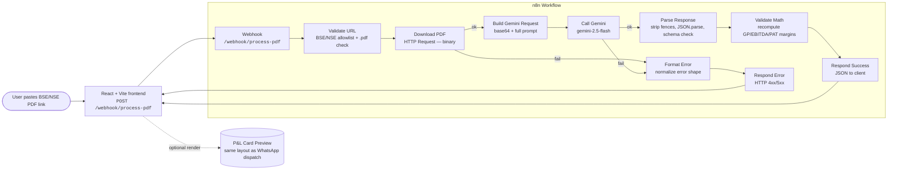

# Architecture

## Why this shape

- **Webhook + Respond-to-Webhook pattern** lets the frontend stream the
  result back synchronously without polling.
- **Validate URL first** keeps junk requests out of Gemini (saves money,
  avoids SSRF).
- **Build Gemini Request in Code node** means the prompt is in the workflow
  JSON — version-controlled, no out-of-band config.
- **Two-stage parse → validate math** treats Gemini's output as untrusted
  by design. Niveshaay analysts won't ship a number Gemini hallucinated.
- **Error funnel through `Format Error`** keeps every failure shape
  identical so the frontend has one error handler, not five.

## Failure isolation

| Stage | Failure mode | Handler |
|---|---|---|
| Webhook | Body missing `pdf_url` | Validate URL throws → Format Error |
| Validate URL | Non-BSE/NSE host, non-PDF, malformed URL | throws → Format Error |
| Download PDF | DNS/timeout/4xx/5xx from BSE | onError branch → Format Error |
| Build Gemini Request | PDF > 20 MB, no binary returned | throws → Format Error |
| Call Gemini | 401/429/500 | onError branch → Format Error |
| Parse Response | `no pnl found` | passes through as `success:false reason:no_pnl_found` |
| Parse Response | bad JSON / schema mismatch | throws → Format Error |
| Validate Math | margin drift > 0.5pp | does **not** fail; surfaces `validation.issues` |
| Respond Success | n/a | returns full payload |

## Why we don't auto-retry inside n8n

Auto-retry is added on the **download** node (BSE 5xx is mostly transient).
It is **intentionally not added** on the Gemini call: a 400 from Gemini
usually means a bad prompt/schema and retrying just burns budget. The
front-end can re-trigger after the user fixes the input.
